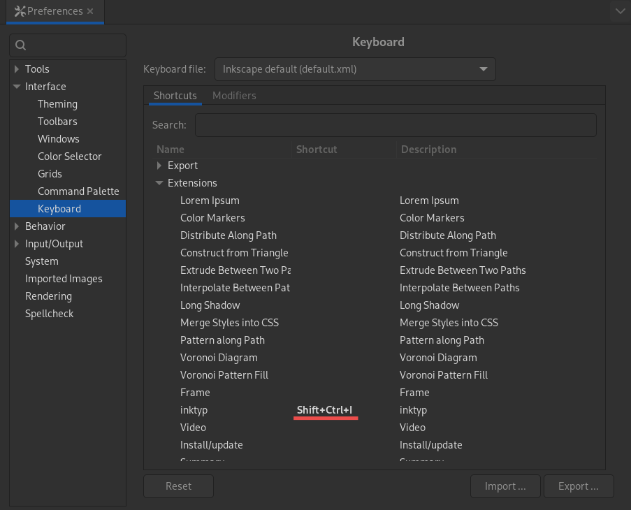

# inktyp

Insert and edit [typst](https://typst.app/) equations in inkscape.


## Installation

```bash
mkdir -p ~/.config/inkscape/extensions
cd ~/.config/inkscape/extensions
git clone https://github.com/herlev/inktyp
cd inktyp
cargo install --path .
```

### Set a keyboard shortcut

In Inkscape go to `Edit > Preferences > Interface > Keyboard` and set a shortcut for inktyp under `effect`.



## Requirements

- pdf2svg
